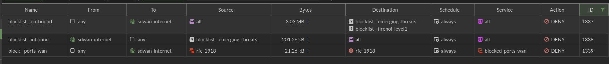

## How to...
### 1. txt
```bash
config system external-resource
edit "blocklist_emerging_threats" 
    set type address
    set resource "https://rules.emergingthreats.net/fwrules/emerging-Block-IPs.txt"
    set refresh-rate 30
next
edit "blocklist_firehol_level1"
    set type address
    set resource "https://iplists.firehol.org/files/firehol_level1.netset"
    set refresh-rate 30
next
end

config firewall service custom
edit "gre"
set category "Tunneling"
set protocol IP
set color 8
set protocol-number 47
next
edit "ah"
set category "Tunneling"
set protocol IP
set color 8
set protocol-number 51
next
edit "esp"
set category "Tunneling"
set protocol IP
set color 8
set protocol-number 50
next
edit "ike"
set category "Tunneling"
set color 8
set udp-portrange 500 4500
next
edit "l2tp"
set category "Tunneling"
set color 8
set tcp-portrange 1701
set udp-portrange 1701
next
edit "pptp"
set category "Tunneling"
set color 8
set tcp-portrange 1723
next
edit "ldap"
set category "Authentication"
set comment "The Lightweight Directory Access Protocol is an open, vendor-neutral, industry standard application protocol for accessing and maintaining distributed directory information services over an Internet Protocol network."
set color 6
set tcp-portrange 389
set udp-portrange 389
next
edit "ldaps"
set category "Authentication"
set comment "LDAP over TLS/SSL"
set color 6
set tcp-portrange 636 3268
next
edit "dhcp"
set category "Network Services"
set color 11
set udp-portrange 67-68
next
edit "radius"
set category "Authentication"
set color 6
set udp-portrange 1812-1813
next
edit "samba"
set category "File Access"
set color 21
set tcp-portrange 139
next
edit "smb"
set category "File Access"
set color 21
set tcp-portrange 445
next
edit "snmp"
set category "Network Services"
set color 11
set tcp-portrange 161-162
set udp-portrange 161-162
next
edit "syslog"
set category "Network Services"
set color 11
set udp-portrange 514
next
edit "netbios"
set category "Network Services"
set comment "Network Basic Input/Output System provides services related to the session layer of the OSI model allowing applications on separate computers to communicate over a local area network."
set color 11
set tcp-portrange 137
set udp-portrange 137-138
next
edit "dce-rpc"
set category "Remote Access"
set color 3
set tcp-portrange 135
set udp-portrange 135
next
edit "kerberos"
set category "Authentication"
set comment "Kerberos is a computer-network authentication protocol that works on the basis of tickets to allow nodes communicating over a non-secure network to prove their identity to one another in a secure manner."
set color 6
set tcp-portrange 88 464
set udp-portrange 88 464
next
edit "rdp"
set category "Remote Access"
set color 3
set tcp-portrange 3389
set udp-portrange 3389
next
edit "all"
set category "General"
set protocol IP
set color 23
next
end

config firewall service group
edit "blocked_ports_wan"
    set member "dhcp" "radius" "samba" "smb" "snmp" "syslog" "netbios" "dce-rpc" "kerberos" "ldap" "ldaps" "rdp" "ah" "esp" "gre" "ike" "l2tp" "pptp"
    set color 6
next
end

config firewall policy
edit 1337 
    set name "blocklist_outbound"
    set srcintf "any"
    set dstintf wan1
    set srcaddr "all"
    set dstaddr "blocklist_emerging_threats" "blocklist_firehol_level1"
    set schedule "always"
    set service "all"
    set logtraffic all
next
edit 1338 
    set name "blocklist_inbound"
    set srcintf wan1
    set dstintf "any"
    set srcaddr "blocklist_emerging_threats"
    set dstaddr "all"
    set schedule "always"
    set service "all"
    set logtraffic all
next
edit 1339 
    set name "block_ports_wan"
    set srcintf "any"
    set dstintf wan1
    set srcaddr "rfc_1918"
    set dstaddr "rfc_1918"
    set schedule "always"
    set service "blocked_ports_wan"
    set logtraffic all
    set dstaddr-negate enable
next


```

