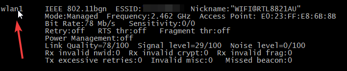

## How to install Archer T2U Plus driver on Raspberry Pi OS 32 bit
### 1. Create dir for drivers
```bash
mkdir ~/git && cd ~/git
```

### 2. Clone driver repo
```bash
git clone https://github.com/morrownr/8821au-20210708.git
```

### 3. Install
```bash
cd rtl8812au && sudo make dkms_install
```
### 4. Check driver status
```bash
dkms status
```
Output should show something like:
```bash
rtl8821au/5.12.5.2, 6.6.31+rpt-rpi-v7, armv7l: installed
```
### 5. Check wirless interface wlan1
```bash
iwconfig
```
You should now see wlan1
